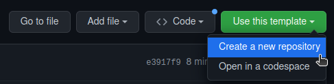

<!-- PROJECT LOGO -->
<div align="center">

# Foodie App!

<div align="center">
  A solution to all your resturants decisions!
  <div>
    <a href="https://github.com/TeaBizzy/rails-react-template/issues">Report Bug</a>
    ·
    <a href="https://github.com/TeaBizzy/rails-react-template/issues">Request Feature</a>
  </div>
</div>
<br />

<div align="left">

---

# Project Description

This project is an web application called Foodie built with React for the front-end and Rails for the API. The application allows users to swipe on resturants near by in real-time. Data is stored by the API server using PostgreSQL and the client application communicates with the API server over HTTP in a JSON format. 
  

The project utilizes React hooks, axios, JSX, HTML, JavaScript, CSS, Ruby on Rails, PSQL, and several other dependencies. 
  
The project is open source and contributions can be made through the provided GitHub link. Contact information for the project team is also provided.

<!-- GETTING STARTED -->
## Getting Started

### Prerequisites

* npm
* node
* ruby
* rails
* postgres

### Installation and Setup

1. Create a new repo from this template.

    

2. Clone your new repo
   ```sh
   git clone git@github.com:<YOUR GITHUB NAME>/<YOUR REPO NAME HERE>.git
   ```

3. Install gems.
    ```sh
    cd server
    bundle install
    ```

4. Create database.yml file.
    ```sh
    # inside the server directory
    cp config/database.yml.example config/database.yml
    ```

5. Enter your database credentials.
    ```yml
    # in server/config/database.yml

    default: &default
    adapter: postgresql
    encoding: unicode

    # -- Change the below --
    username: # Your username here
    password: # Your password here
    # -- Change the above --

    host: localhost #
    port: 5432 #
    # For details on connection pooling, see Rails configuration guide
    # https://guides.rubyonrails.org/configuring.html#database-pooling
    pool: <%= ENV.fetch("RAILS_MAX_THREADS") { 5 } %>
    ```

6. Create, migrate, and seed the database.
  
    <b>NOTE:</b> running migrate & seed here will create some example data. If you do not want this data you can skip migration and seeding.

    ```sh
    # inside the server directory
    rake db:create
    rake db:migrate # Will create example table
    rake db:seed # Will seed example data
    ```

7. Install npm packages.
    ```sh
    # inside the client directory
    npm install
    ```

8. Create .env file.
    ```sh
    # inside the client directory
      cp .env.example .env
    ```

### Changing Ports / Domains

1. Change the React App Port / Domain
    ```sh
    # inside client/.env
    PORT=YOUR PORT HERE
    ```

2. Updating CORS

    <b>NOTE:</b> Updating the react port OR deploying the site will require CORS to be updated.
    ```rb
    # inside server/config/initializers/cors.rb

    Rails.application.config.middleware.insert_before 0, Rack::Cors do
      allow do
        origins "http://localhost:8080" # Set to the client domain.

        resource "*",
          headers: :any,
          methods: [:get, :post, :put, :patch, :delete, :options, :head]
      end
    end
    ```

3. Changing the Rails Port

    <b>NOTE:</b> Updating the Rails port will require an update inside client/.env
    ```rb
    # inside /server/config/puma.rb

    port ENV.fetch("PORT") { YOUR PORT HERE }
    ```

### Accessing the Website

1. Start the server

    <b>NOTE:</b> Run in its own terminal.
   ```sh
   # Run while in the /server directory.
   rails server
   ```

2. Launch the client

    <b>NOTE:</b> Run in its own terminal.
   ```sh
   # Run while in the /client directory.
   npm start
   ```

---


## Pages

### Logging in
  
https://user-images.githubusercontent.com/112907944/213276355-2eadab72-9af0-46f5-8763-23df046a8532.mp4


### Registering


https://user-images.githubusercontent.com/112907944/213276449-df106809-ba81-4e8e-be6d-4fa988df9afc.mp4


### Swiping


https://user-images.githubusercontent.com/112907944/213277599-062b5b56-6e76-4078-afe7-5dc7bc6c8a8a.mp4


### Create Session

https://user-images.githubusercontent.com/112907944/213276476-a2d38fed-fd22-455e-a214-2b1298c9e5b3.mp4


## Project Stack
Front-End: React, Axios, JSX, HTML, JavaScript, CSS
Back-End: Ruby on Rails, PSQL
## Dependencies
- Axios
- Classnames
- Normalize.css
- React
- React-dom
- React-scripts
- Google Places Api
- Action Mailer
- PSQL
- useState, useEffect and useNavigate
- tinderCard
- google_places 
- bCrypt
- geoCoder


<!-- CONTACT -->
## Contact

#### Stefan Talbot - satalbot@protonmail.com
#### Rahim Jamal  - rahimj2196@gmail.com 
#### Kelvin Huang - kelvin.huang98@hotmail.com


#
Project Link: [https://github.com/TeaBizzy/rails-react-app-template](https://github.com/TeaBizzy/rails-react-app-template)
